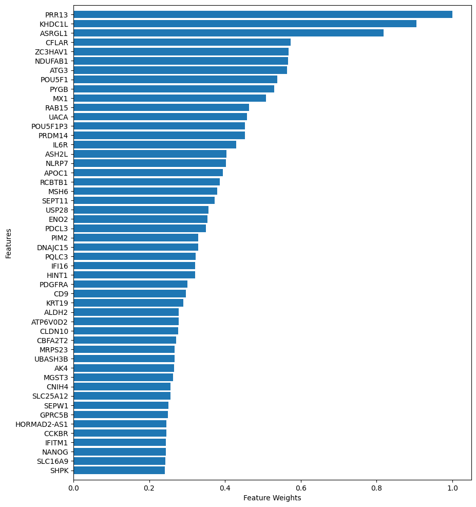
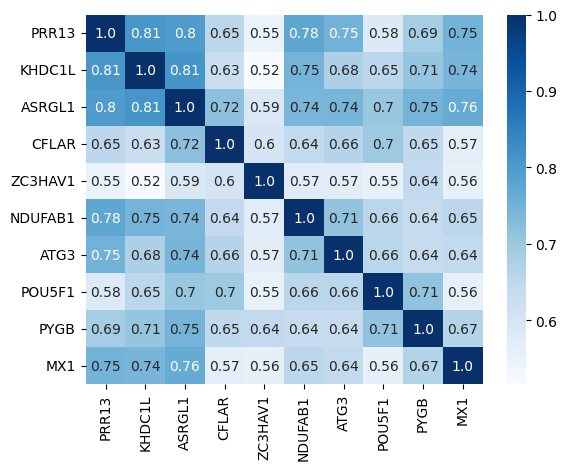
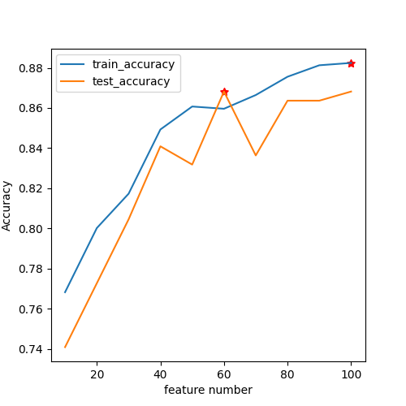
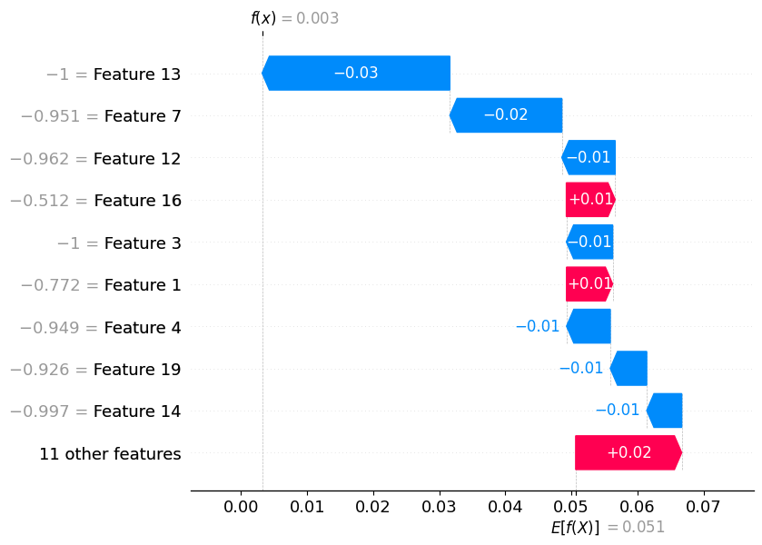
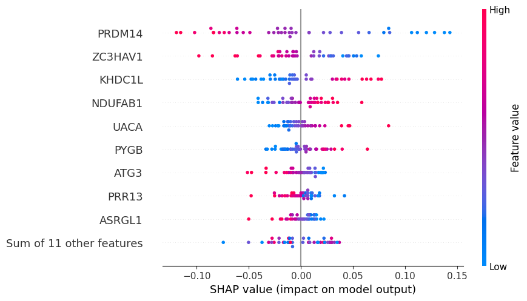
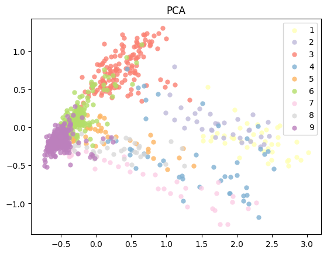
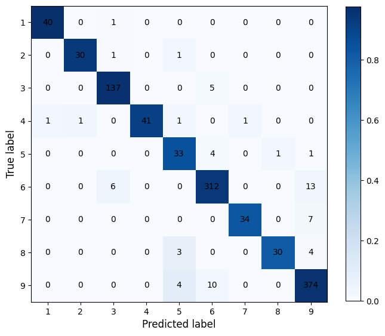

.. _plot:

====
Plot
====

Plot module have three submodules.

* **FW** (Feature weights)
* **cor** (Feature Correlation (cor) analysis)
* **IFS** (Incremental feature selection curves)
* **waterfall** (Feature waterfall based on shap values)
* **beeswarm** (Feature beeswarm based on shap values of specific category)
* **PCA** (Principal component analysis)
* **CM** (Confusion matrix)

Feature Weights (FW)
--------------------
FW module shows the feature selection method to plot the contribution of each feature.

+---------------+------------------+------------------------------------------------+
| Parameters    | Optional         | Descripton                                     |
+---------------+------------------+------------------------------------------------+
| -i, ---input  | filename path    | Feature importance dataframe path (CSV format) |
+---------------+------------------+------------------------------------------------+
| ---format     | png, pdf         | Picture format                                 |
+---------------+------------------+------------------------------------------------+
| -n, ---number | int (default=50) | Number of features shown in the picture        |
+---------------+------------------+------------------------------------------------+
| -o, ---output | directory        | output directory (default:Current directory)   |
+---------------+------------------+------------------------------------------------+

**FW example**

.. code-block:: bash
    
    # If you do not have a dataframe of feature importances,
    # Please run $Feature_scML fs -i example.csv -m fscore
    $Feature_scML plot FW -i example_fscore.csv
    # get example_fscore_FeatureWeight.png in the current directory.

    

    
    example_fscore_FeatureWeight.png

Feature Correlation (cor) analysis
----------------------------------
cor module shows the feature correlation based on pearson, spearman, or kendall method
to plot the correlation of every two features.

+-----------------------+--------------------------+----------------------------------------------------+
| Parameters            | Optional                 | Descripton                                         |
+-----------------------+--------------------------+----------------------------------------------------+
| -i, ---input          | filename path            | Feature dataframe path (CSV format)                |
+-----------------------+--------------------------+----------------------------------------------------+
| -m, ---method         | pearson,spearman,kendall | correlation measure                                |
+-----------------------+--------------------------+----------------------------------------------------+
| ---format             | png, pdf                 | Picture format (default=png)                       |
+-----------------------+--------------------------+----------------------------------------------------+
| -n, ---feature_number | int (default=10)         | Number of top-ranked features shown in the picture |
+-----------------------+--------------------------+----------------------------------------------------+
| -o, ---output         | directory                | output directory (default:Current directory)       |
+-----------------------+--------------------------+----------------------------------------------------+

**cor example**

.. code-block:: bash
    
    # If you do not have a dataframe of feature importances,
    # Please run $Feature_scML fs -i example.csv -m fscore
    $Feature_scML plot cor -i example_fscore_data.csv -m pearson -n 10
    # get pearson_correlation_example_fscore_data_10.png in the current directory.

    
    pearson_correlation_example_fscore_data_10.png

Incremental Feature Selection (IFS) Curves
------------------------------------------
IFS (incremental feature selection curves) evaluates the classification performance 
of the top-k-ranked features iteratively for k ∈ (1, 2, …, n), 
where n is the total number of features.

+---------------+---------------+----------------------------------------------+
| Parameters    | Optional      | Descripton                                   |
+---------------+---------------+----------------------------------------------+
| -i, ---input  | filename path | IFS dataframe path (CSV format)              |
+---------------+---------------+----------------------------------------------+
| ---format     | png, pdf      | Picture format                               |
+---------------+---------------+----------------------------------------------+
| -o, ---output | directory     | output directory (default:Current directory) |
+---------------+---------------+----------------------------------------------+

**IFS example**

.. code-block:: bash
    
    # If you do not have a dataframe of incremental feature classification performance,
    # Please run $Feature_scML automl -i example.csv -c svm -m fscore --njobs 20
    $Feature_scML plot IFS -i 10-100_fscore_SVM_accuracy.csv
    # get 10-100_fscore_SVM_accuracy_IFS.png in the current directory.

    
    10-100_fscore_SVM_accuracy_IFS.png

waterfall
---------
waterfall (Feature waterfall based on shap values) shows each feature of shap values 
for a specific sample.

+-----------------------+---------------+-------------------------------------------------------------+
| Parameters            | Optional      | Descripton                                                  |
+-----------------------+---------------+-------------------------------------------------------------+
| -i, ---input          | filename path | dataframe path (CSV format)                                 |
+-----------------------+---------------+-------------------------------------------------------------+
| ---format             | png, pdf      | Picture format                                              |
+-----------------------+---------------+-------------------------------------------------------------+
| ---model_path         | filename path | Model file path (joblib)                                    |
+-----------------------+---------------+-------------------------------------------------------------+
| ---method             | svm           | Model name                                                  |
+-----------------------+---------------+-------------------------------------------------------------+
| -n, ---feature_number | int           | Consistent with the number of features trained by the model |
+-----------------------+---------------+-------------------------------------------------------------+
| -o, ---output         | directory     | Output directory (default:Current directory)                |
+-----------------------+---------------+-------------------------------------------------------------+

**waterfall example**

.. code-block:: bash
    
    # Feature_scML automl -i example.csv -c svm -m fscore --njobs 20 --getmodel True
    $Feature_scML plot waterfall -i example_fscore_data.csv --model_path example_20_svm.joblib -s 0 -n 20

    
    example_fscore_data_simple_feature_contribute.png

beeswarm
---------
The beeswarm plot shows an information-dense summary of 
how the top features in a dataset impact the model’s output. 

+-----------------------+---------------+-------------------------------------------------------------+
| Parameters            | Optional      | Descripton                                                  |
+-----------------------+---------------+-------------------------------------------------------------+
| -i, ---input          | filename path | dataframe path (CSV format)                                 |
+-----------------------+---------------+-------------------------------------------------------------+
| ---format             | png, pdf      | Picture format                                              |
+-----------------------+---------------+-------------------------------------------------------------+
| ---model_path         | filename path | Model file path (joblib)                                    |
+-----------------------+---------------+-------------------------------------------------------------+
| ---method             | svm           | Model name                                                  |
+-----------------------+---------------+-------------------------------------------------------------+
| -n, ---feature_number | int           | Consistent with the number of features trained by the model |
+-----------------------+---------------+-------------------------------------------------------------+
| -s, ---sample_label   | int           | label category to(0, 1, ...)                                |
+-----------------------+---------------+-------------------------------------------------------------+
| -o, ---output         | directory     | Output directory (default:Current directory)                |
+-----------------------+---------------+-------------------------------------------------------------+

**beeswarm example**

.. code-block:: bash
    
    # Feature_scML automl -i example.csv -c svm -m fscore --njobs 20 --getmodel True
    # Evaluate the summary shap value of all samples with a strategy of 1.
    $Feature_scML plot beeswarm -i example_fscore_data.csv --model_path example_20_svm.joblib  -n 20 -s 1

    
    example_fscore_data_simple_feature_summary.png

Principal Component Analysis (PCA)
----------------------------------
The PCA plot shows the influence of different feature clustering on sample clustering.

+-----------------------+---------------+----------------------------------------------+
| Parameters            | Optional      | Descripton                                   |
+-----------------------+---------------+----------------------------------------------+
| -i, ---input          | filename path | dataframe path (CSV format)                  |
+-----------------------+---------------+----------------------------------------------+
| ---format             | png, pdf      | Picture format                               |
+-----------------------+---------------+----------------------------------------------+
| -n, ---feature_number | int           | feature number                               |
+-----------------------+---------------+----------------------------------------------+
| -o, ---output         | directory     | Output directory (default:Current directory) |
+-----------------------+---------------+----------------------------------------------+

**PCA example**

.. code-block:: bash
    
    $Feature_scML plot PCA -i example_fscore_data.csv -n 100

    
    example_fscore_data_100_PCA.png

Confusion matrix (CM)
---------------------
CM module evaluates classification accuracy 
by computing the confusion matrix with each row corresponding to the true class

+-----------------------+---------------+----------------------------------------------+
| Parameters            | Optional      | Descripton                                   |
+-----------------------+---------------+----------------------------------------------+
| -i, ---input          | filename path | dataframe path (CSV format)                  |
+-----------------------+---------------+----------------------------------------------+
| ---format             | png, pdf      | Picture format                               |
+-----------------------+---------------+----------------------------------------------+
| ---model_path         | filename path | Model file path (joblib)                     |
+-----------------------+---------------+----------------------------------------------+
| -n, ---feature_number | int           | feature number                               |
+-----------------------+---------------+----------------------------------------------+
| -o, ---output         | directory     | Output directory (default:Current directory) |
+-----------------------+---------------+----------------------------------------------+

**CM example**

.. code-block:: bash

    # $Feature_scML automl -i example.csv -c svm -m fscore 
    $Feature_scML plot CM -i example_fscore_data.csv -n 100 --model_path example_100_svm.joblib

    
    confusion_matrix_example_fscore_data_100.png